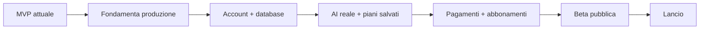

# DietaSprint AI - Backlog produzione

## Obiettivo

Portare DietaSprint AI da MVP demo a prodotto pubblico affidabile, sicuro e monetizzabile.

## Vista rapida

## Kanban

| Priorita | Backlog | Prossimo sprint | In produzione |
| --- | --- | --- | --- |
| P0 | Privacy/GDPR definitivo | Deploy Vercel | MVP locale |
| P0 | Database profili e piani | Dominio custom | Landing + planner |
| P0 | Autenticazione | Error tracking | Piano 7 giorni mock |
| P1 | AI server-side | Analytics privacy-first | Pagine legali MVP |
| P1 | Stripe subscriptions | Email contatto/supporto | Audit npm pulito |
| P1 | Export PDF reale | QA mobile | Build Next valida |
| P2 | Coach anti-fame reale | Copy conversione | Repo GitHub |
| P2 | Area famiglia | SEO base |  |

## Milestone

### 1. Go-live demo
- Deploy su Vercel.
- Dominio custom.
- Privacy, cookie, termini e disclaimer revisionati.
- Analytics privacy-first.
- Error tracking.
- Test mobile e desktop.

### 2. Prodotto utilizzabile
- Login e account.
- Database Supabase/Postgres.
- Salvataggio profilo utente.
- Salvataggio piani generati.
- Storico piani.
- Preferenze alimentari persistenti.

### 3. AI reale
- Endpoint server-side per generazione piani.
- Prompt protetti lato server.
- Guardrail salute e calorie basse.
- Logging degli errori AI senza salvare dati sensibili inutili.
- Rigenerazione pasto reale.
- Sostituzioni coerenti con dieta, budget e calorie.

### 4. Monetizzazione
- Stripe checkout.
- Piano Free, Premium e Pro.
- Customer portal.
- Limiti per piano.
- Webhook Stripe.
- Stato abbonamento in database.

### 5. Qualita produzione
- Test automatici su calcolo calorie.
- Test generatore pasti.
- Test e2e onboarding -> risultati.
- Lighthouse mobile.
- Accessibilita base.
- Backup e policy dati.

## Definition of Done produzione

- Build e deploy automatici da GitHub.
- Nessuna vulnerabilita npm nota.
- Form con validazione robusta.
- Dati utente salvati in modo sicuro.
- Nessuna chiave API nel browser.
- Copy senza claim medici.
- Legale revisionato per GDPR.
- Monitoraggio errori attivo.
- Pagamenti testati in sandbox.
- Percorso utente mobile fluido.
